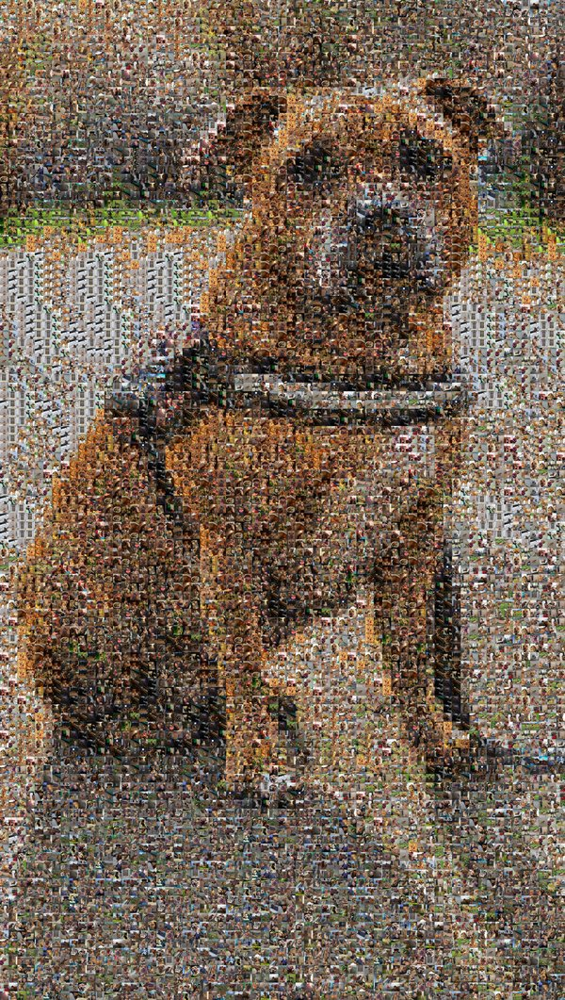

# Bonnie Photomosaic

A photomosaic web app that recreates a target photo of Bonnie out of hundreds of smaller tile photos, each picked by closest average colour match.

## How it works

- A Python pipeline (`bonnie.py`, built with Pillow) computes the average colour of every tile photo and of every cell in the target image, using the `.resize((1, 1))` trick, with `LANCZOS` resampling for accuracy.
- Each target cell is matched to the tile with the closest colour (squared RGB distance).
- A usage-count penalty (`REPEAT_PENALTY`) discourages any one tile from being picked too often, and a spatial cooldown further discourages the *same* tile from reappearing near where it was last used, to avoid visible clumping.
- Matched tiles are cached after their first resize so repeat picks skip redundant decode/resample work.

## Planned architecture

- The mosaic-building logic will be wrapped in a Vercel Python serverless function (`api/`).
- That function returns **JSON grid metadata** (which tile belongs in each cell, plus grid dimensions) rather than a single rendered image — this avoids Vercel's response-size limits on large images and lets the frontend assemble the mosaic itself.
- The frontend (**Next.js**) renders that metadata as a grid of images and supports zooming in/out, so individual tile photos become visible on zoom without needing a single massive pre-rendered image.
- Tile photos are served as static files from `public/`, committed directly into the repo.

See `TODO.md` for the current build checklist and status.

## License

The code in this repository is licensed under MIT.

The tile and target photos included in this repo are personal photos (of Bonnie, family, and friends) and are **not** covered by the MIT license — they're included only so the app can function, not for reuse or redistribution.
